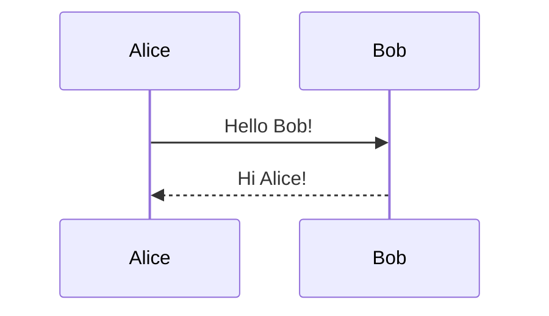
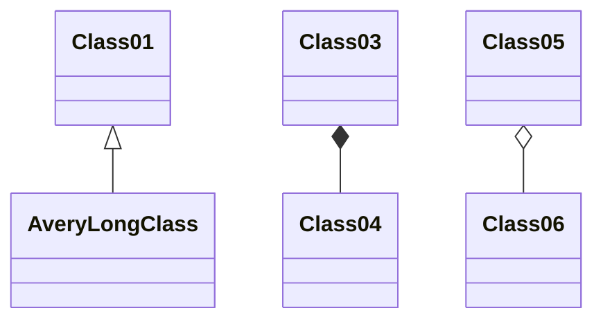

# Observable Framework - Documentación Técnica

Documentación técnica de Observable Framework para el proyecto PAES 2026.

**Fuente**: [Observable Framework Documentation](https://observablehq.com/framework/)

---

## Tabla de Contenidos

1. [Estructura del Proyecto](#estructura-del-proyecto)
2. [Markdown](#markdown)
3. [JavaScript](#javascript)
4. [Reactividad](#reactividad)
5. [Data Loaders](#data-loaders)
6. [Imports](#imports)
7. [Configuración](#configuración)
8. [Temas](#temas)
9. [Parámetros y Rutas Dinámicas](#parámetros-y-rutas-dinámicas)
10. [Page Loaders](#page-loaders)
11. [Bibliotecas](#bibliotecas)

---

## Estructura del Proyecto

Un proyecto de Framework consiste en:

- **Páginas** (`.md`) - Archivos Markdown
- **Data loaders** (`.csv.py`, `.json.ts`, etc.) - Generan datos estáticos
- **Archivos estáticos** (`.csv`, `.json`, `.parquet`, etc.)
- **Componentes compartidos** (`.js`)
- **Configuración** (`observablehq.config.js`)

### Estructura típica

```
.
├── src                          # source root
│   ├── .observablehq
│   │   ├── cache                # data loader cache
│   │   └── deploy.json          # deployment metadata
│   ├── components
│   │   └── dotmap.js            # módulo JavaScript compartido
│   ├── data
│   │   └── quakes.csv.ts        # data loader
│   ├── index.md                 # home page
│   └── quakes.md                # página
├── .gitignore
├── observablehq.config.js       # configuración de la app
├── package.json
└── yarn.lock
```

### Directorios clave

- **src**: Source root (configurable via `root` en config)
- **src/.observablehq/cache**: Caché de data loaders
- **src/components**: Módulos JavaScript compartidos
- **src/data**: Data loaders y archivos estáticos

### Routing

Framework usa file-based routing:

```
/             → dist/index.html  → src/index.md
/hello        → dist/hello.html  → src/hello.md
/missions/    → dist/missions/index.html → src/missions/index.md
```

---

## Markdown

Framework extiende [CommonMark](https://commonmark.org/) con características útiles para apps de datos.

### Front Matter

```yaml
---
title: Mi página favorita
toc: false
draft: false
theme: dashboard
sidebar: true
---
```

**Opciones de front matter:**
- `title` - Título de la página
- `index` - Si indexar para búsqueda (default: true)
- `keywords` - Palabras adicionales para búsqueda
- `draft` - Si omitir durante build
- `sql` - Definiciones de tablas para SQL code blocks
- `toc` - Tabla de contenidos
- `style` - Stylesheet personalizado
- `theme` - Tema visual
- `sidebar` - Mostrar sidebar

### HTML en Markdown

```html
<div class="grid grid-cols-4">
  <div class="card">

Este es **Markdown** dentro de _HTML_!

  </div>
</div>
```

### Grids (CSS Grid)

```html
<div class="grid grid-cols-4">
  <div class="card"><h1>A</h1></div>
  <div class="card"><h1>B</h1></div>
  <div class="card"><h1>C</h1></div>
  <div class="card"><h1>D</h1></div>
</div>
```

**Clases disponibles:**
- `grid-cols-2`, `grid-cols-3`, `grid-cols-4`
- `grid-colspan-*`, `grid-rowspan-*`

### Cards

```html
<div class="card" style="max-width: 640px;">
  <h2>Título</h2>
  <h3>Subtítulo</h3>
  ${Plot.lineY(data, {x: "date", y: "value"}).plot()}
</div>
```

### Notes (Callouts)

```html
<div class="note">This is a note.</div>
<div class="tip">This is a tip.</div>
<div class="warning">This is a warning.</div>
<div class="caution">This is a caution.</div>
```

**Con label personalizado:**
```html
<div class="warning" label="⚠️ Danger ⚠️">Contenido aquí</div>
```

---

## JavaScript

JavaScript se puede expresar como **fenced code blocks** o **inline expressions**.

### Fenced Code Blocks

**Expression block** (sin punto y coma, display implícito):
```js
1 + 2
```

**Program block** (con punto y coma, sin display implícito):
```js
const foo = 1 + 2;
display(foo);
```

**Mostrar código con `echo`:**
````markdown
```js echo
1 + 2
```
````

**Solo mostrar código sin ejecutar:**
````markdown
```js run=false
1 + 2
```
````

### Inline Expressions

```markdown
Lanzaste un ${Math.floor(Math.random() * 20) + 1}.
La hora actual es ${new Date(now).toLocaleTimeString("en-US")}.
```

### TypeScript

Usa bloques ` ```ts ` en lugar de ` ```js `. Importa módulos `.ts` usando extensión `.js`.

### Display explícito

```js
const x = Math.random();
display(x);

// Múltiples valores
for (let i = 0; i < 5; ++i) {
  display(i);
}
```

### Responsive Display

**Variable `width` reactiva:**
```js
Plot.barX([9, 4, 8, 1, 11, 3, 4, 2, 7, 5]).plot({width})
```

**Función `resize` para contenedores:**
```html
<div class="card">
  ${resize((width) => Plot.barX(data).plot({width}))}
</div>
```

**Con altura:**
```html
<div class="grid grid-cols-2" style="grid-auto-rows: 240px;">
  <div class="card" style="padding: 0;">
    ${resize((width, height) => Plot.barY(data).plot({width, height}))}
  </div>
</div>
```

### Variables Built-in

- `width` - Ancho del elemento main en pixels
- `now` - Tiempo actual en milliseconds (se actualiza ~60fps)

---

## Reactividad

Framework ejecuta código reactivamente como una hoja de cálculo: el código se re-ejecuta automáticamente cuando las variables referenciadas cambian.

### Variables Top-Level

```js
const x = 1, y = 2;
```

Variables declaradas en un bloque son accesibles desde otros bloques en la misma página.

**Variables locales (no reactivas):**
```js
{
  const z = 3; // Solo visible dentro de este bloque
}
```

### Promises (Await Implícito)

```js
const volcano = FileAttachment("volcano.json").json();
```

Al referenciar `volcano` en otro bloque, el await es implícito:
```js
volcano.values.length // No necesita await
```

**Carga paralela de archivos:**
```js
const a = FileAttachment("a.csv").csv({typed: true});
const b = FileAttachment("b.csv").csv({typed: true});
const c = FileAttachment("c.csv").csv({typed: true});
```

### Generators

```js
const name = Generators.input(nameInput);
```

**Crear generator con observe:**
```js
const pointer = Generators.observe((notify) => {
  const pointermoved = (event) => notify([event.clientX, event.clientY]);
  addEventListener("pointermove", pointermoved);
  notify([0, 0]);
  return () => removeEventListener("pointermove", pointermoved);
});
```

**Generator de animación:**
```js
const i = (function* () {
  for (let i = 0; true; ++i) {
    yield i;
  }
})();
```

### Inputs

```js
const team = view(Inputs.radio(["Option A", "Option B", "Option C"], {
  label: "Selecciona:",
  value: "Option A"
}));
```

**Input personalizado:**
```js
const n = view(html`<input type=range step=1 min=1 max=15>`);
```

**Chart como input (con tip):**
```js
const penguin = view(Plot.dot(penguins, {
  x: "culmen_length_mm",
  y: "flipper_length_mm",
  tip: true
}).plot());
```

### Mutables

```js
const count = Mutable(0);
const increment = () => ++count.value;
const reset = () => count.value = 0;
```

```js
Inputs.button([["Increment", increment], ["Reset", reset]])
```

### Invalidation

Para limpiar recursos cuando un bloque se re-ejecuta:

```js
let frame = requestAnimationFrame(function tick(now) {
  // animación
  frame = requestAnimationFrame(tick);
});

invalidation.then(() => cancelAnimationFrame(frame));
```

### Visibility

Esperar hasta que el contenido sea visible:

```js
await visibility();
// El código siguiente se ejecuta cuando el elemento es visible
```

---

## Data Loaders

Los data loaders generan snapshots estáticos de datos durante el build.

### Ejemplo básico (Shell)

`quakes.json.sh`:
```bash
curl -f https://earthquake.usgs.gov/earthquakes/feed/v1.0/summary/all_day.geojson
```

### Ejemplo JavaScript

`quakes.csv.js`:
```js
import {csvFormat} from "d3-dsv";

const response = await fetch("https://earthquake.usgs.gov/earthquakes/feed/v1.0/summary/all_day.geojson");
if (!response.ok) throw new Error(`fetch failed: ${response.status}`);
const collection = await response.json();

const features = collection.features.map((f) => ({
  magnitude: f.properties.mag,
  longitude: f.geometry.coordinates[0],
  latitude: f.geometry.coordinates[1]
}));

process.stdout.write(csvFormat(features));
```

### Uso en el cliente

```js
const quakes = FileAttachment("quakes.csv").csv({typed: true});
```

### Extensiones soportadas

| Extensión | Lenguaje | Intérprete |
|-----------|----------|------------|
| `.js` | JavaScript | `node` |
| `.ts` | TypeScript | `tsx` |
| `.py` | Python | `python3` |
| `.R` | R | `Rscript` |
| `.sh` | Shell | `sh` |
| `.exe` | Ejecutable | - |

### Archives (ZIP, TAR)

`quakes.zip.ts`:
```ts
import {csvFormat} from "d3-dsv";
import JSZip from "jszip";

const zip = new JSZip();
zip.file("metadata.json", JSON.stringify(metadata, null, 2));
zip.file("features.csv", csvFormat(features));
zip.generateNodeStream().pipe(process.stdout);
```

**Acceso a archivos del ZIP:**
```js
const metadata = FileAttachment("quakes/metadata.json").json();
const features = FileAttachment("quakes/features.csv").csv({typed: true});
```

### Caché

- Ubicación: `.observablehq/cache`
- Durante preview: Se invalida si el loader es más nuevo que el caché
- Durante build: Solo ejecuta si no hay caché

**Limpiar caché:**
```bash
rm -rf src/.observablehq/cache
```

### Virtual Environment (Python)

```bash
# Crear venv
python3 -m venv .venv

# Activar (macOS/Linux)
source .venv/bin/activate

# Instalar dependencias
pip install -r requirements.txt
```

---

## Imports

### npm Imports

```js
import confetti from "npm:canvas-confetti";
import {rollup} from "npm:d3-array";
import * as d3 from "npm:d3";
```

**Con versión específica:**
```js
import confetti from "npm:canvas-confetti@1";
```

**Entry point específico:**
```js
import mime from "npm:mime/lite";
```

### Node Imports (desde node_modules)

```bash
npm install canvas-confetti
```

```js
import confetti from "canvas-confetti";
```

### Local Imports

`foo.js`:
```js
export const foo = 42;
```

```js
import {foo} from "./foo.js";
```

**Con FileAttachment:**
```js
import {FileAttachment} from "observablehq:stdlib";

export const sales = await FileAttachment("sales.csv").csv({typed: true});
```

### Remote Imports

```js
import confetti from "https://cdn.jsdelivr.net/npm/canvas-confetti/+esm";
```

### Dynamic Imports

```js
const {default: confetti} = await import("npm:canvas-confetti");
```

### Import Resolution

```js
import.meta.resolve("npm:canvas-confetti")
// Retorna URL resuelta
```

**Descargar archivos de npm:**
```js
const data = await fetch(import.meta.resolve("npm:us-atlas/counties-albers-10m.json")).then((r) => r.json());
```

### Implicit Imports

Disponibles por defecto en Markdown:

```js
// Stdlib
FileAttachment, Generators, Mutable, resize

// Bibliotecas
d3, Plot, Inputs, html, svg, L (Leaflet), mermaid
Arrow, aq (Arquero), DuckDBClient, sql
echarts, mapboxgl, topojson, lodash, React, ReactDOM
```

---

## Configuración

`observablehq.config.js`:

```js
export default {
  title: "Mi App",
  root: "src",
  output: "dist",
  theme: "dashboard",

  pages: [
    {
      name: "Sección 1",
      path: "/s01/",
      pages: [
        {name: "Página 1", path: "/s01/page1"},
        {name: "Página 2", path: "/s01/page2"}
      ]
    }
  ],

  sidebar: true,
  pager: true,

  toc: {
    show: true,
    label: "Contenidos"
  },

  search: true,

  head: `<meta name="author" content="Autor">`,

  header: `<div>Header personalizado</div>`,

  footer: ({path}) => `<a href="https://github.com/example/repo/blob/main/src${path}.md">ver código</a>`,

  // Interpreters adicionales
  interpreters: {
    ".pl": ["perl"],
    ".scpt": ["osascript"]
  },

  // DuckDB extensions
  duckdb: {
    extensions: ["spatial", "h3"]
  }
};
```

### Opciones principales

| Opción | Descripción | Default |
|--------|-------------|---------|
| `root` | Source root | `src` |
| `output` | Output root | `dist` |
| `title` | Título de la app | - |
| `theme` | Tema visual | `default` |
| `style` | Stylesheet personalizado | - |
| `sidebar` | Mostrar sidebar | true si pages no está vacío |
| `pages` | Navegación del sidebar | Auto-detectado |
| `pager` | Links prev/next | true |
| `toc` | Tabla de contenidos | true |
| `search` | Habilitar búsqueda | false |

---

## Temas

### Light Mode

`air` (default), `cotton`, `glacier`, `parchment`

### Dark Mode

`coffee`, `deep-space`, `ink`, `midnight`, `near-midnight` (default), `ocean-floor`, `slate`, `stark`, `sun-faded`

### Auto Mode

Combina temas light y dark según preferencia del usuario:

```js
theme: ["glacier", "slate"]
```

### Modificadores

- `alt` - Intercambia colores de fondo de página y cards
- `wide` - Columna principal a ancho completo

### Alias

- `default` = `[light, dark]` = `[air, near-midnight]`
- `dashboard` = `[light, dark, alt, wide]`

### CSS Custom Properties

```css
--theme-foreground        /* color de texto */
--theme-background        /* color de fondo */
--theme-background-alt    /* color de fondo de bloques */
--theme-foreground-alt    /* color de headings */
--theme-foreground-muted  /* texto secundario */
--theme-foreground-faint  /* bordes */
--theme-foreground-focus  /* color de énfasis */
```

**Uso en Plot:**
```js
Plot.lineY(data, {
  x: "Date",
  y: "Close",
  stroke: "var(--theme-foreground-focus)"
}).plot()
```

### Stylesheet personalizado

```css
@import url("observablehq:default.css");
@import url("observablehq:theme-air.css");

:root {
  --theme-foreground-focus: green;
}
```

---

## Parámetros y Rutas Dinámicas

### Estructura

```
src/
└── products/
    └── [product].md
```

### Configuración

```js
export default {
  dynamicPaths: [
    "/products/100736",
    "/products/221797",
    "/products/399145"
  ]
};
```

**Dinámicamente:**
```js
export default {
  async *dynamicPaths() {
    for await (const {id} of sql`SELECT id FROM products`.cursor()) {
      yield `/products/${id}`;
    }
  }
};
```

### Acceso a parámetros en JavaScript

```js
// En [product].md
const product = observable.params.product;
```

```js
// FileAttachment con parámetro
const info = FileAttachment(`${observable.params.product}.json`).json();
```

### En Data Loaders

`sales-[product].csv.js`:
```js
import {parseArgs} from "node:util";

const {values: {product}} = parseArgs({
  options: {product: {type: "string"}}
});

// Usar product en query...
```

---

## Page Loaders

Page loaders generan páginas Markdown dinámicamente.

### Ejemplo

`quakes.md.js`:
```js
import * as d3 from "d3-geo";
import * as topojson from "topojson-client";

const quakes = await (await fetch("...")).json();
const world = await (await fetch("...")).json();
const land = topojson.feature(world, world.objects.land);

const projection = d3.geoOrthographic().rotate([110, -40]).fitExtent([[2, 2], [638, 638]], {type: "Sphere"});
const path = d3.geoPath(projection);

process.stdout.write(`# Recent quakes

<svg viewBox="0 0 640 640" width="640" height="640">
  <path stroke="currentColor" d="${path(d3.geoGraticule10())}"></path>
  <path stroke="var(--theme-red)" d="${path(quakes)}"></path>
</svg>
`);
```

### Con parámetros

`sales-[product].md.js`:
```js
import {parseArgs} from "node:util";

const {values: {product}} = parseArgs({
  options: {product: {type: "string"}}
});

process.stdout.write(`# Sales of product ${product}

\`\`\`js
const sales = FileAttachment(\`sales-${product}.csv\`).csv({typed: true});
\`\`\`

\`\`\`js
Plot.plot({
  marks: [
    Plot.barY(sales, {x: "sale_day", y: "total_sales_amount", tip: true}),
    Plot.ruleY([0])
  ]
})
\`\`\`
`);
```

---

## Bibliotecas

### Observable Plot

```js
import * as Plot from "npm:@observablehq/plot";

// Bar chart
Plot.rectY(data, {x: "category", y: "value"}).plot()

// Line chart
Plot.lineY(data, {x: "date", y: "value"}).plot({y: {grid: true}})

// Sparkline inline
${Plot.lineY([1, 2, 0, 4, 3]).plot({axis: null, width: 80, height: 17})}
```

### Leaflet

```js
import * as L from "npm:leaflet";

const div = display(document.createElement("div"));
div.style = "height: 400px;";

const map = L.map(div).setView([51.505, -0.09], 13);

L.tileLayer("https://tile.openstreetmap.org/{z}/{x}/{y}.png", {
  attribution: '&copy; OpenStreetMap'
}).addTo(map);

L.marker([51.5, -0.09])
  .addTo(map)
  .bindPopup("Punto de interés")
  .openPopup();
```

### Mermaid

````markdown

````

**En JavaScript:**
```js
mermaid`graph TD;
  A-->B;
  A-->C;
  B-->D;
  C-->D;`
```

**Diagrama de secuencia:**


**Diagrama de clases:**


---

## Comandos

```bash
# Desarrollo
npm run dev          # Inicia servidor de preview en localhost:3000

# Build
npm run build        # Genera sitio estático en dist/

# Limpiar caché
rm -rf .observablehq/cache/
```

---

*Documentación generada desde [Observable Framework](https://observablehq.com/framework/) el 2026-01-08*
